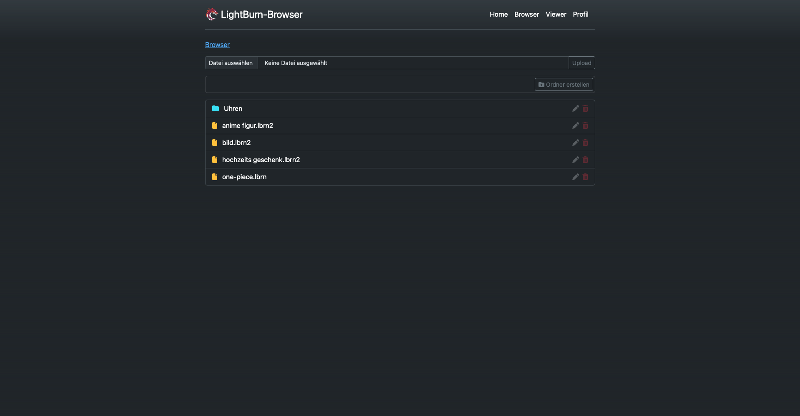
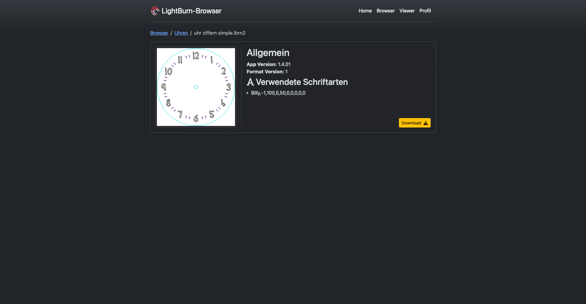

# Minimalistischer LightBurn - Datei-Browser

<p align="center">
  
</p>

## Über das Projekt

Dieses Projekt ist ein minimalistischer Datei-Browser für `.lbrn` und `.lbrn2` Dateien.
Diese Dateiformate werden von der Software LightBurn erstellt und verwendet.
Mit diesem PHP-Projekt können Sie alle Dateien und Ordner in einem konfigurierbaren Subpfad durchsuchen, sich durch die Ordner bewegen und die Dateien ansehen.

---

## Funktionen

### Aktuell implementiert

1. **Datei- und Ordneransicht**: Anzeige aller Dateien und Ordner im konfigurierten Subpfad.
2. **Datei-Viewer**: Zeigt ein Thumbnail-Bild der Datei, verwendete Schriftarten und die Version von LightBurn, die bei der Erstellung verwendet wurde.
3. **Datei-Interaktionen**: Unterstützt das Herunterladen und Hinzufügen von Dateien.

### Geplant (TODO)


1. Umbenennen von Dateien und Ordnern.
2. Löschen von Dateien und Ordnern.
3. Verschieben von Datein
4. Zwei-Faktor-Authentifizierung (2FA).

---

## Technologien

- [PHP 8.1](https://www.php.net)
- [Smarty (über Composer installiert)](https://github.com/smarty-php/smarty)
- [Bootstrap 5.3.1 ](https://getbootstrap.com/)

---

## Installation

1. **Klonen Sie das Repository**: `git clone ...`
2. **Navigieren Sie zum Projektordner**: `cd LightBurnBrowser`
3. **Installieren Sie die Abhängigkeiten**: `composer install`

---

## Konfiguration

1. Öffnen Sie `config.php`.
2. Ändern Sie den Wert der Variable, um den Subpfad festzulegen, in dem die Dateien gespeichert werden sollen.

```php
define('BROWSER_PATH', '....');
```

---

## Verwendung

1. Starten Sie Ihren lokalen Server.
2. Navigieren Sie zu `http://localhost:port/` in Ihrem Webbrowser.

---

## Screenshots




---

## Lizenz

Dieses Projekt steht unter der GNU Affero General Public License v3.0 <br>
-> siehe die [LICENSE](LICENSE) Datei für Details.


---

## Anmerkungen

Dieses Projekt ist noch in der Entwicklung. Bei Fehlern oder Verbesserungsvorschlägen können Sie gerne ein Issue erstellen oder einen Pull Request senden.